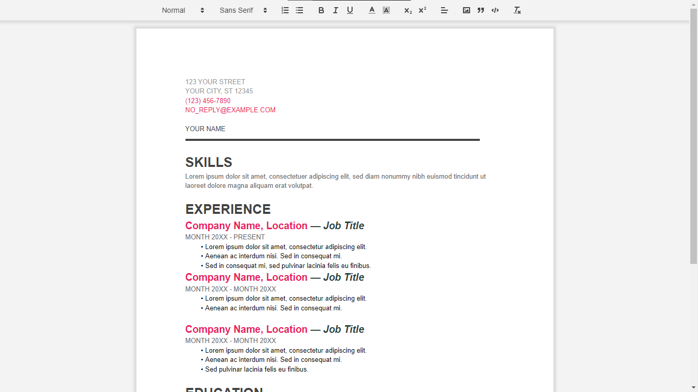

# NoteFlow

NoteFlow is a real-time collaboration application that enables multiple users to collaboratively edit documents simultaneously.

## Features

- **Real-Time Collaboration:** Users can collaborate on documents in real-time, seeing changes instantly.
- **Quill Editor Integration:** Utilizes the Quill rich text editor for a smooth editing experience.
- **Express Backend:** Express.js framework used for server-side operations.
- **Socket.IO:** Enables real-time bidirectional event-based communication between clients and the server.
- **MongoDB with Mongoose:** Utilizes MongoDB as the database with Mongoose as an ODM.

## Technologies Used

- React
- React Router
- Quill Editor
